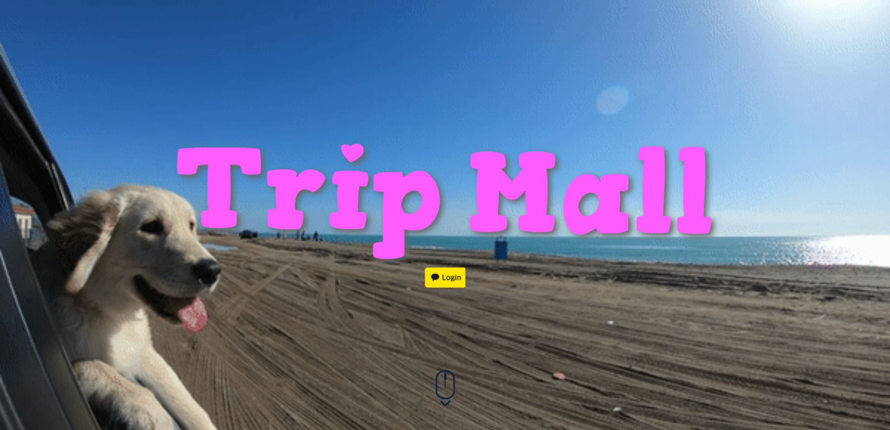
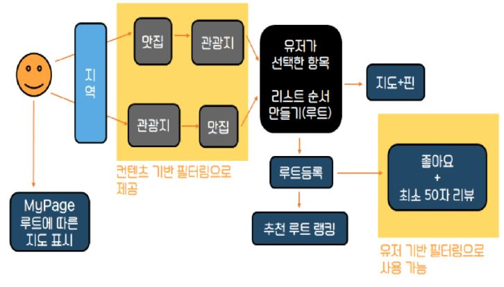
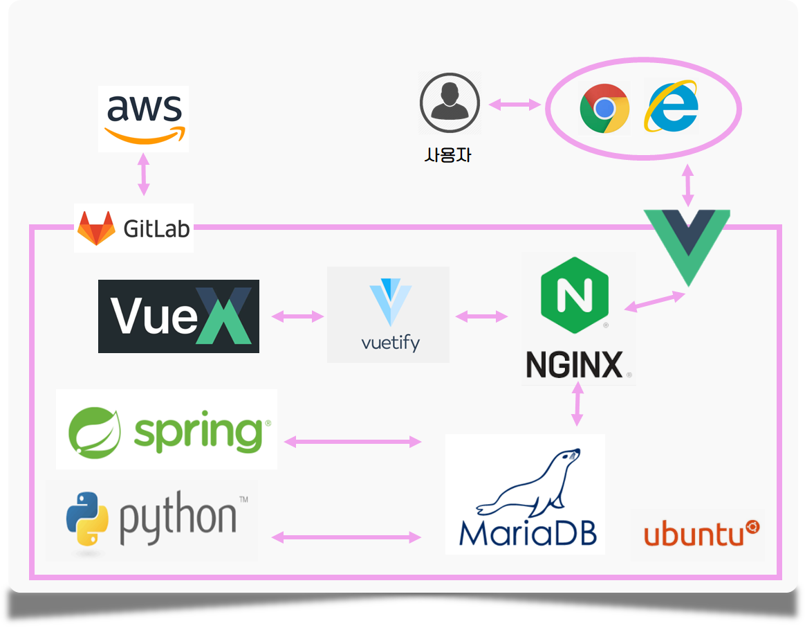
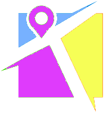

# :world_map: **TripMall** :beach_umbrella:
  

  

## 목차
- [팀소개](#팀소개)
- [개요](#개요)
- [기획](#기획)
- [기능](#기능)
- [기대 효과](#기대-효과)
- [기술 스택](#기술-스택)
- [기술 설명](#기술-설명)
- [TMI](#TMI)
- [테스트 방법](#테스트-방법)  

  
  
## 팀소개

### :loudspeaker: M1F3
> 'Male 1 Female 3'이라는 뜻으로 남자 한명, 여자 세명으로 구성한 팀입니다:)

👩‍💻 [back-end, 팀장] 손예지

👨‍💻 [back-end, UCC] 김영호	

👩‍💻  [front-end, AWS] 정아영	

👩‍💻  [front-end, 디자인] 송복민	

   
 
## 개요

> :black_nib: 사용자가 여행 코스를 검색하고 알고리즘에 맞게 추천 받아 입맛에 맞게 커스터마이징하여 상호 간의 여행 정보를 공유하는 서비스

  

## 기획
:page_facing_up:  https://docs.google.com/presentation/d/1QyeifVruObYXYow4jZXPAqftfRfTSEV9sLZjjGmyJIs/edit?usp=sharing

  

## 기능

#### PICK MYSELF :triangular_flag_on_post:
> 사용자 친화적인 검색 시스템과 사용자가 직접 선택하는 본인만의 리스트를 제공합니다.
> Provides a user-friendly search system and your own personal list of choices.

#### EASY VIEW :world_map:
> 선택한 리스트를 바로 지도에서 확인할 수 있습니다.
> You can view the selected list directly on the map.

#### RANK AND RECOMMEND :trophy:
> 다른 사용자가 만든 경로와 기본적으로 제공하는 추천 경로를 볼 수 있습니다.
> You can view paths created by other users and recommended paths provided by default.

#### ROUTE STAMPING :ticket:
> 본인이 저장한 다양한 코스들을 지도에 스탬프로 남겨진 것을 확인 할 수 있습니다.
> You can check that the various courses you have saved are stamped on the map.

  

## 기대 효과
> 효율적인 루트 여행 루트를 짤 수 있습니다.

> 빅데이터기반의 추천을 받아 만족스러운 여행을 기획할 수 있습니다.

> 추억스탬프로 나의 추억을 한눈에 저장할 수 있습니다.

  

## 기술 스택

  

## 기술 설명

#### 거리 기반 필터링

#### 컨텐츠 기반 필터링
> __음식점__ 메뉴-메뉴 유사도 행렬 (:ice_cream:-:ramen:)

> __관광지__ 상세정보-상세정보 유사도 행렬 (:bridge_at_night:-:sailboat:)

#### 유저 기반 협업필터링
> 연령-성별 유사도 행렬 (👫-👶👨🧔)

  

## TMI

> 원래 우리 팀명은 M1F4로 남자1, 여자4이었다. 하지만 한명이 나가게 되어 M1F3가 되었다.

> 재은아.. 잘 살고 있지..? 보구싶댜..☆:sob:

  

## 테스트 방법 :computer:
> http://k3b302.p.ssafy.io/